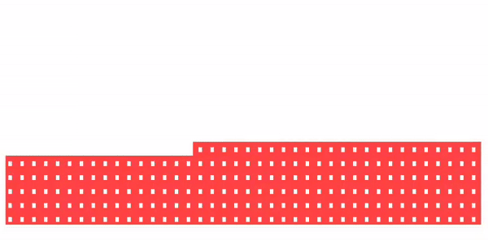

## Android Audio Visualizer (Kotlin)
[](https://kotlinlang.org/)
[](LICENSE)
[](#)
---

A lightweight, customizable, and smooth Audio Visualizer library for Android, built using Kotlin and Custom Views.

This library provides multiple visualizer styles with gradient, glow, and smooth animations, while staying decoupled from MediaPlayer so it works with any audio source.

---

### Features

- Multiple visualizer styles
- Smooth animations (LERP smoothing)
- Gradient effects
- Glow / neon effects
- XML & runtime customization
- MediaPlayer-independent (audio-session based)

---

### Preview

<p align="center">
<table>
  <tr>
    <td align="center">
      
    </td>
    <td align="center">
      
    </td>
  </tr>
  <tr>
    <td align="center">
      
    </td>
    <td align="center">
      
    </td>
  </tr>
</table>
</p>

---

## Installation (JitPack)

### 1️⃣ Add JitPack to your **root `settings.gradle` or `build.gradle`**

```gradle
dependencyResolutionManagement {
    repositories {
        google()
        mavenCentral()
        maven { url 'https://jitpack.io' }
    }
}
```
### Add Dependency
```
dependencies {
	        implementation 'com.github.Excelsior-Technologies-Community:Android_AudioVisualizer:1.0.0'
	}
```

---

### Basic Usage (XML)

XML
```xml
<com.ext.audiovisualizer.view.AudioVisualizerView
    android:id="@+id/audioVisualizer"
    android:layout_width="match_parent"
    android:layout_height="220dp"

    app:av_style="bar"
    app:av_barColor="#00FF00"
    app:av_barCount="48"
    app:av_barWidth="6dp" />
```

Runtime Customization (Public API)
```kotlin
val mediaPlayer = MediaPlayer.create(this, R.raw.sample)
mediaPlayer.start()

audioVisualizer.setAudioSessionId(mediaPlayer.audioSessionId)
audioVisualizer.setVisualizerStyle(VisualizerStyle.CIRCLE)
audioVisualizer.setBarColor(Color.CYAN)
audioVisualizer.setBarCount(60)

audioVisualizer.enableGradient(
    startColor = Color.CYAN,
    endColor = Color.MAGENTA
)

audioVisualizer.enableGlow(radius = 20f)
```

### XML Attributes

| Attribute | Description | Default |
|---------|------------|---------|
| `av_style` | Visualizer style (`bar`, `wave`, `circle`, `stackedBars`) | `bar` |
| `av_barColor` | Bar / line color | `Green` |
| `av_barCount` | Number of bars | `40` |
| `av_barWidth` | Width of bars | `8dp` |
| `av_enableGradient` | Enable gradient effect | `false` |
| `av_gradientStartColor` | Gradient start color | `barColor` |
| `av_gradientEndColor` | Gradient end color | `barColor` |
| `av_enableGlow` | Enable glow effect | `false` |
| `av_glowRadius` | Glow blur radius | `20dp` |

---

### License

```
MIT License

Copyright (c) 2025 Excelsior Technologies 

Permission is hereby granted, free of charge, to any person obtaining a copy
of this software and associated documentation files (the "Software"), to deal
in the Software without restriction, including without limitation the rights
to use, copy, modify, merge, publish, distribute, sublicense, and/or sell
copies of the Software, and to permit persons to whom the Software is
furnished to do so, subject to the following conditions:

The above copyright notice and this permission notice shall be included in all
copies or substantial portions of the Software.

THE SOFTWARE IS PROVIDED "AS IS", WITHOUT WARRANTY OF ANY KIND, EXPRESS OR
IMPLIED, INCLUDING BUT NOT LIMITED TO THE WARRANTIES OF MERCHANTABILITY,
FITNESS FOR A PARTICULAR PURPOSE AND NONINFRINGEMENT. IN NO EVENT SHALL THE
AUTHORS OR COPYRIGHT HOLDERS BE LIABLE FOR ANY CLAIM, DAMAGES OR OTHER
LIABILITY, WHETHER IN AN ACTION OF CONTRACT, TORT OR OTHERWISE, ARISING FROM,
OUT OF OR IN CONNECTION WITH THE SOFTWARE OR THE USE OR OTHER DEALINGS IN THE
SOFTWARE.
```
